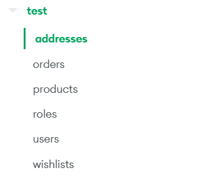
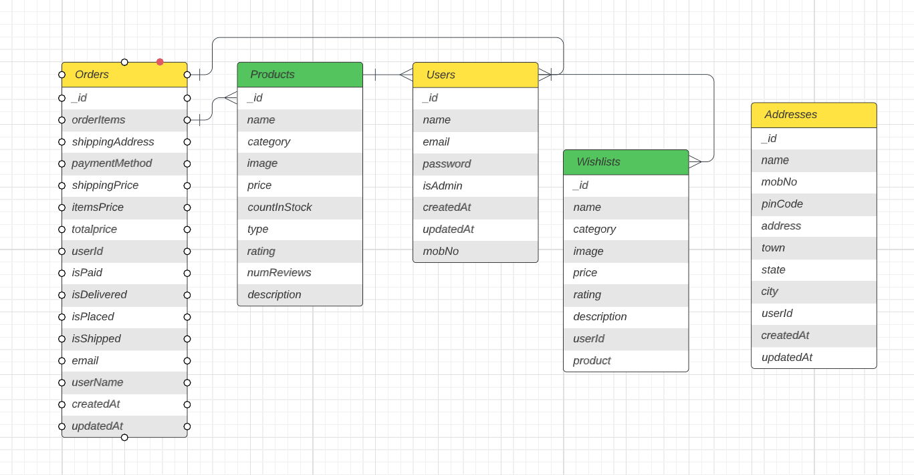

# NOSQL Coffee

NOSQL Coffee - web application for online ordering of dishes in particular coffee.

# Description

This project was created for the NOSQL subject as a demonstration of the working RESTful API based on MongoDB.

It uses such languages and frameworks as Javascript, React.js, Node.js, and MongoDB Atlas.
## Installation

Use the package manager [npm]() to start.

```bash
#frontend terminal
npm start

#backend terminal
npm start
```

## What is in this project

- Authentication and Authentication
- CRUD to modify profile and address data
- Shopping cart
- Favorite Items
- Search engine
- Payment of API
- Discount system
- Checks for orders
##DataSet


Order is associated with an Address and a User. An Order can have many Order Items. A User can have multiple Orders and Wishlists. A Product is associated with multiple Orders and Wishlists.


## License

[MIT](https://choosealicense.com/licenses/mit/)